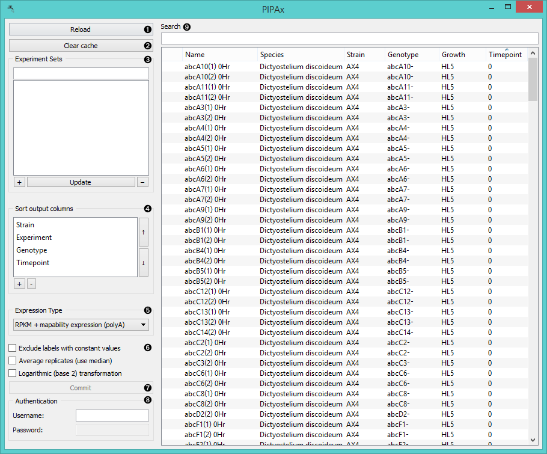
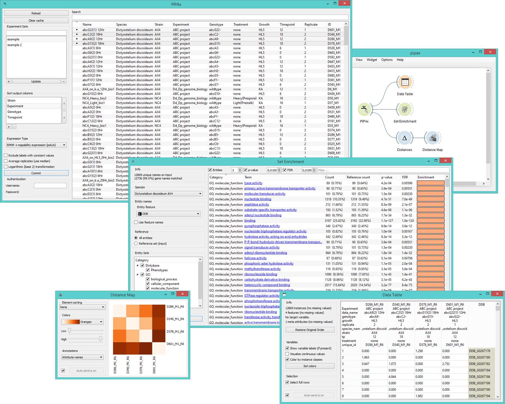

PIPAx
=====

Gives access to [**PIPA**](http://pipa.biolab.si/hp/index.html#) databases.

Signals
-------

**Inputs**:

- (None)

**Outputs**:

- **Data**

  Selected experiments. Each annotated column contains results
  of a single experiment or, if the corresponding option is
  chosen, the average of multiple replicates.

Description
-----------

**PIPAx** is a widget for a direct access to [**PIPA**](http://pipa.biolab.si/hp/index.html#) database.
It is very similar to the **GenExpress** and **GEO Data Sets** widgets as it allows you to download the data from 
selected experiments.

1. Reloads the experiment data.
2. The widget will save (cache) downloaded data, which makes them also available offline. To reset the widget click *Clear cache*.
3. Use *Experiment Sets* to save a selection:
   select the experiments, click the "**+**" button and name the
   set. To add experiments to the set, click on its name, select
   additional experiments and click *Update*. To remove the set click "**-**".
4. In *Sort output columns* set the attributes by which the output columns are sorted.
   Add attributes with a "+" button and remove them
   with "-". Switch the sorting order with arrows on the right.
5. Set the expression type for your output data.
   - **Raw expression** outputs raw experiment data
   - **RPKM expression** outputs data in *reads per kilobase of transcript per million mapped reads*
   - **RPKM expression + mapability expression** uses similar normalization, but divides with gene 
     mapability instead of exon lengths. The polyA variants use only polyA (mRNA) mapped hits.
6. **Exclude labels with constant values** removes attribute labels that are the same for all selected 
    experiments from the output data. 
   **Average replicates (use median)** averages identical experiments by using medians as values. 
   **Logarithmic (base 2) transformation** computes the log2(value+1) for each value.
7. Click *Commit* to output selected experiments.
8. Log in to access private data.
9. Experiments can be filtered with the *Search* box.
   To select which attributes to display right-click on the header. To select multiple experiments 
   click them while holding the *Control/Command* key.

Example
-------

In the schema below we connected **PIPAx** to **Data Table**, **Set Enrichment**, and **Distance Map**
(through **Distances**) widgets.

The **Data Table** widget above contains the output from the **PIPAx** widget.
Each column contains gene expressions of a single experiment. The labels
are shown in the table header. The **Distance Map** widget shows distances between experiments. The
distances are measured with **Distance** widget, which was set to
compute *Euclidean* distances.
