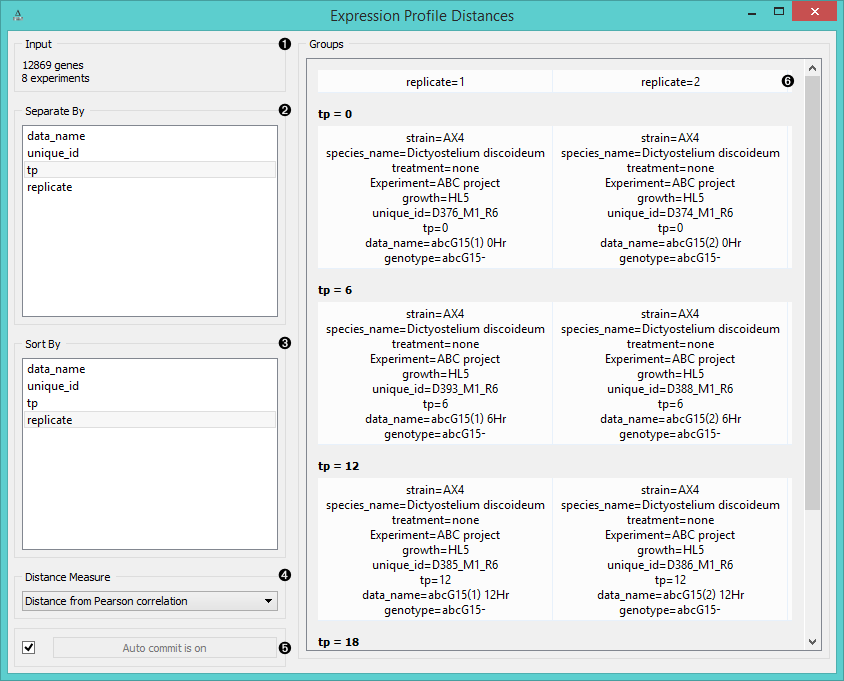
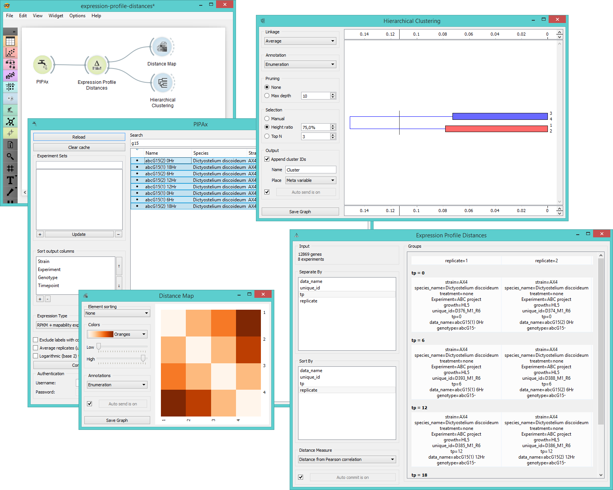

Expression Profile Distances
============================

Computes distances between gene expression levels.

Signals
-------

**Inputs**:

- **Data**

  Data set.

**Outputs**:

- **Distances**

  Distance matrix.
  
- **Sorted Data**

  Data with groups as attributes.

Description
-----------

Widget **Expression Profile Distances** computes distances between expression levels among groups of data.
Groups are data clusters set by the user through *separate by* function in the widget. Data can be separated by one or
more variable labels (usually timepoint, replicates, IDs, etc.). Widget outputs distance matrix that can be fed into
**Distance Map** and **Hierarchical Clustering** widgets.

1. Information on the input data.
2. Separate the experiments into groups by labels (normally timepoint, replicates, data name, etc.).
3. Sort the experiments inside the group by labels.
4. Choose the *Distance Measure*:
    - [**Pearson**](https://en.wikipedia.org/wiki/Pearson_product-moment_correlation_coefficient) (linear correlation between the values, remapped as a distance in a [0, 1] interval)
    - [**Euclidean**](https://en.wikipedia.org/wiki/Euclidean_distance) ("straight line", distance between two points)
    - [**Spearman**](https://en.wikipedia.org/wiki/Spearman's_rank_correlation_coefficient) (linear correlation between the rank of the values, remapped as a distance in a [0, 1] interval)
5. If *Auto commit is on*, the widget will automatically compute the distances and output them. Alternatively click *Commit*.
6. This snapshot shows 4 groups of experiments (tp=0, tp=6, tp=12, tp=18) with 2 experiments (replicates) in each group.

Example
-------

**Expression Profile Distances** widget is used to calculate distances between gene expression values
sorted by labels. We chose 8 experiments measuring gene expression levels on *Dictyostelium discoideum* at
different timepoints. In the **Expression Profile Distances** widget we separated the data by timepoint
and sorted them by replicates. We could see the grouping immediately in the *Groups* box on the right. Then we
fed the results to **Distance Map** and **Hierarchical Clustering** to visualize the distances 
and cluster the attributes.

