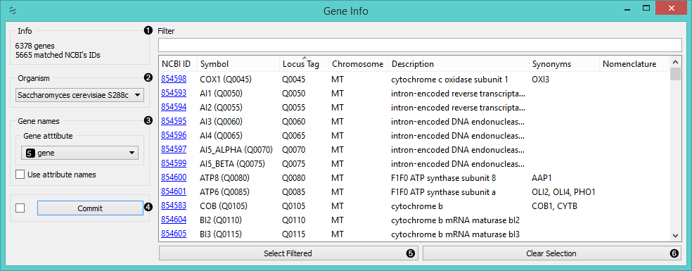
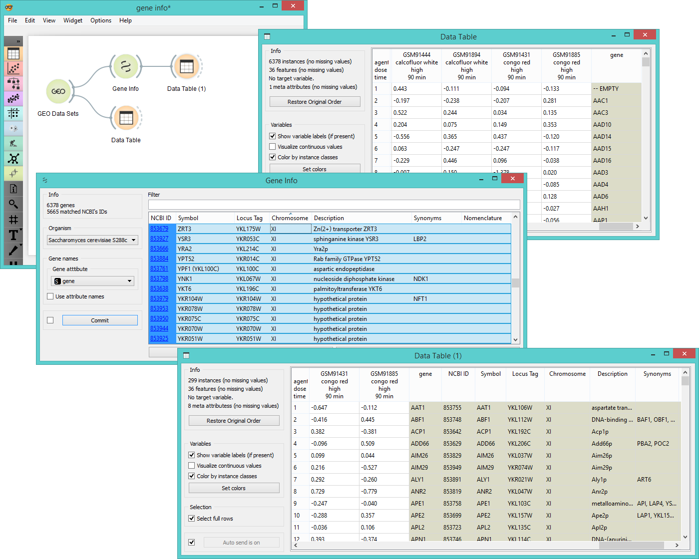

Gene Info
=========

Displays information on the genes in the input.

Signals
-------

**Inputs**:

- **Data**

  Data set.

**Outputs**:

- **Selected Data**

  Instances with meta data that the user has manually selected in the widget.

Description
-----------

A useful widget that presents information on the genes from the [NCBI database](http://www.ncbi.nlm.nih.gov/gene).
You can also select a subset and feed it to other widgets. By clicking on the gene NCBI ID in the list, you will
be taken to the NCBI site with the information on the gene.

1. Information on data set size and genes that matched the NCBI ID's.
2. Select the organism of reference.
3. Set the source of gene names. If your gene names are placed as attributes names, select *Use attribute names*.
4. If *Auto commit is on*, changes will be communicated automatically. Alternatively click *Commit*.
5. In the row above the list you can filter the genes by search word(s). If you wish to output the filtered data,
   click *Select Filtered*.
6. If you wish to start from scratch, click *Clear Selection*.

Example
-------

Below we first view the entire *Caffeine effect: time course and dose response* data set in the *Data Table*
widget. Then we feed the same data into the *Gene Info*, where we select only the genes that are located
on the 11th chromosome. We can observe these data in another *Data Table*, where additional information
on the selected genes are appended as meta attributes.

